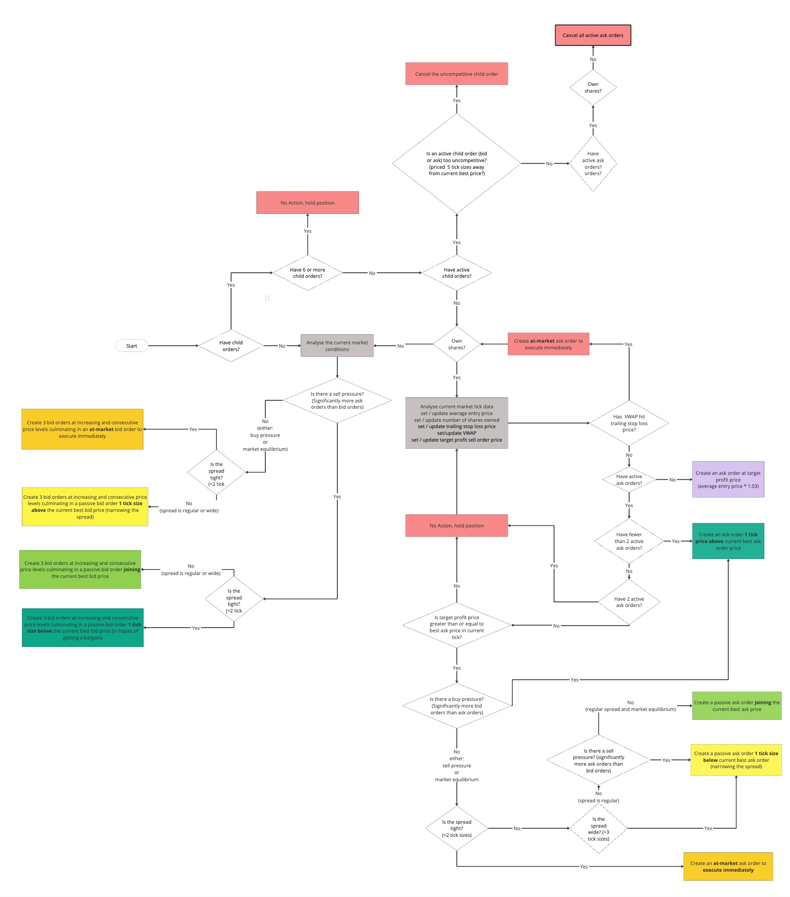

# Onuora's Trading Algo

Welcome to my electronic trading algorithm!

### My Rationale

My algo takes into account the spread as well as the quantity of bid orders and ask orders on the market to establish if there is a buy pressure or a sell pressure.
It then places orders accordingly. Please see the flow diagram below which illustrates the decisions that my algo makes. You can also click on [MyAlgoLogicFlowDiagram.jpg]() to zoom in and move around the diagram. 




### How to Run The Algo

#### Pre-requisites

1. The project requires Java version 17 or higher

##### Note
This project is configured for Java 17. If you have a later version installed, it will compile and run successfully, but you may see warnings in the log like this, which you can safely ignore:

```sh
[WARNING] system modules path not set in conjunction with -source 17
```

#### Opening the project

1. Fork this repo in GitHub and clone it to your local machine
2. Open the project as a Maven project in your IDE (normally by opening the top level pom.xml file)
3. Click to expand the "getting-started" module
4. Navigate to [MyAlgoLogic.java](https://github.com/ow1609/trading-algorithm-assessment/blob/cancel-order-logic/algo-exercise/getting-started/src/main/java/codingblackfemales/gettingstarted/MyAlgoLogic.java), [MyAlgoBackTest.java](https://github.com/ow1609/trading-algorithm-assessment/blob/cancel-order-logic/algo-exercise/getting-started/src/test/java/codingblackfemales/gettingstarted/MyAlgoBackTest.java) and [AbstractAlgoBackTest.java](https://github.com/ow1609/trading-algorithm-assessment/blob/cancel-order-logic/algo-exercise/getting-started/src/test/java/codingblackfemales/gettingstarted/AbstractAlgoBackTest.java) 
5. You're ready to run the algorithm and back tests!

##### Note
You will first need to run the Maven `install` task to make sure the binary encoders and decoders are installed and available for use. You can use the provided Maven wrapper or an installed instance of Maven, either in the command line or from the IDE integration.

To get started, run the following command from the project root: `./mvnw clean install`. Once you've done this, you can compile or test specific projects using the `--projects` flag, e.g.:

- Clean all projects: `./mvnw clean`
- Run all tests in MyAlgoBackTest: `./mvnw clean test --projects algo-exercise/getting-started -Dtest=MyAlgoBackTest`
- Run a single test in MyAlgoBackTest: `./mvnw clean test --projects algo-exercise/getting-started -Dtest=MyAlgoBackTest#nameOfTheTestYouWouldLikeToRun`
- Compile the `getting-started` project only: `./mvnw compile --projects algo-exercise/getting-started`